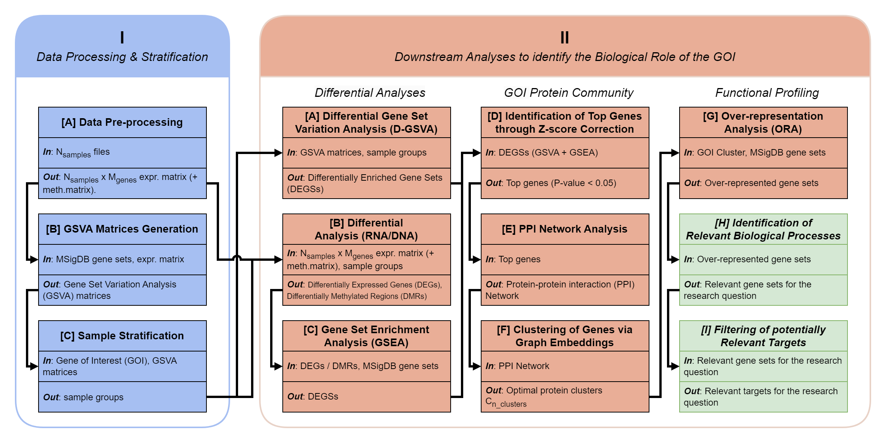

<div id="top"></div>

<!-- PROJECT LOGO -->
<br />
<div align="center">
  

  <h1 align="center">GoiStrat</h1>
  <h4 align="center">Gene-of-interest-based sample stratification for the evaluation of functional differences</h4>

</div>

<!-- TABLE OF CONTENTS -->
<details>
  <summary>Table of Contents</summary>
  <ol>
    <li>
      <a href="#about-the-project">About The Project</a>
      <ul>
        <li><a href="#data">Data</a></li>
      </ul>
    </li>
    <li>
      <a href="#getting-started">Getting Started</a>
      <ul>
        <li><a href="#prerequisites">Prerequisites</a></li>
        <li><a href="#installation">Installation</a></li>
        <li><a href="#usage">Usage</a></li>
        <li><a href="#file-descriptions">File descriptions</a></li>
      </ul>
    </li>
    <li><a href="#additional-notes">Additional Notes</a></li>
    <li><a href="#license">License</a></li>
    <li><a href="#contact">Contact</a></li>
    <li><a href="#acknowledgments">Acknowledgments</a></li>
    <li><a href="#citation">Citation</a></li>
  </ol>
</details>

## About The Project

This repository contains the implementation of *GoiStrat - Gene-of-interest-based sample stratification for the evaluation of functional differences*. See [publication]() for details.

The implementation was done entirely in Python, using [*rpy2*](https://github.com/rpy2/rpy2) wrappers for all necessary R packages.

### Data

This workflow was tested by applying it to *FOLH1* in prostate cancer. The data sources used were:

- The Prostate Cancer Transcriptome Atlas (PCTA) [[Paper](https://www.nature.com/articles/s41467-021-26840-5)].
- The Cancer Genome Atlas Prostate Adenocarcinoma (TCGA-PRAD) | [[Paper](https://pubmed.ncbi.nlm.nih.gov/26544944/)].
- The West Coast Prostate Cancer Dream Team - Metastatic Castration Resistant Prostate Cancer (WCDT-MCRPC) | [[Paper 1](https://pubmed.ncbi.nlm.nih.gov/30033370/), [Paper 2](https://pubmed.ncbi.nlm.nih.gov/33077885/)].

If you wish you reproduce the results shown in the paper, you must obtain the permissions from the owners of the data when required. Downloading and processing of the data is also a pre-requisite. Helper functions and scripts under `src/pipelines/data` were used for such purposes.

<p align="right">(<a href="#top">back to top</a>)</p>

<!-- GETTING STARTED -->

## Getting Started

### Prerequisites

You should have an Anaconda environment installed in your UNIX system (currently only Ubuntu/CentOS has been tested). I recommend using `Miniforge3`:

```bash
wget https://github.com/conda-forge/miniforge/releases/latest/download/Miniforge3-Linux-x86_64.sh
bash Miniforge3-Linux-x86_64.sh
```

More detailed instructions to setup Anaconda using Miniforge3 can be found [in their GitHub page](https://github.com/conda-forge/miniforge).

### Installation

Here's a step-by-step guide to setup the library:

1. Clone this repository:

```bash
git clone https://github.com/CarlosUziel/goi-strat
```

1. Install conda environment with all dependencies (using mamba):

```bash
conda install -n base -c conda-forge mamba
bash goi-strat/setup_env.sh
```

This will take a while, have patience.

3. Set `PYTHONPATH` variable (preferably in your `.bashrc` file or equivalent):

```bash
export PYTHONPATH="/home/{user}/goi-strat/src":$PYTHONPATH
```

Now you are ready to start using the **GoiStrat** workflow!

<!-- USAGE EXAMPLES -->

### Usage

While this library contains plenty of ready-to-use scripts to build complete pipelines, it also provides multiple utility functions that can be used individually as per user needs. A special effort has been put into making the design of the library highly modular and flexible for different use cases. Feel free to submerge yourself in the codebase.

The entire workflow (except the processing of FASTQ files) is described in `src/pipelines/psma_levels_workflow.sh`. If you need to process FASTQ files to obtain DNA methylation signatures, please refer to the scripts under `src/pipelines/fastq_processing`.

### File descriptions

This repository is organized as follows:

- `docs`: Files of the main workflow figure.
- `notebooks/paper-figures.ipynb`: Jupyter notebook to reproduce all figures shown in the paper.
- `src/components`: Component classes used in various pipelines, mainly for functional analysis.
- `src/data`: Helper functions for data processing.
- `src/pipelines`: Multiple individual scripts, each representing a step in the workflow. See details below for each step (in alphabetical order):
  - `src/pipelines/data`: Downloads data, its annotations and applies some minor pre-processing steps. Relevant R packages used here include **DESeq2**, **msigdbr** and **TCGAbiolinks**.
  - `src/pipelines/degss_genes_stats`: Obtains gene statistics from differentially enriched gene sets (DEGSs).
  - `src/pipelines/degss_ppi_networks`: Generates PPI networks from the genes within DEGSs. PPI relationships are extracted from *STRINGDB* using the R package **rbioapi**.
  - `src/pipelines/degss_ppi_networks_clustering`: Clusters proteins in the PPI networks using **Node2Vec** embeddings and ensemble clustering.
  - `src/pipelines/differential_enrichment`: Runs differential enrichment analyses with **limma**, obtaining DEGSs in the process.
  - `src/pipelines/differential_expression`: Runs differential expression analyses with **DESeq2**, obtaining differentially expressed genes (DEGs) in the process.
  - `src/pipelines/differential_methylation`: Runs differential methylation analyses with **minfi** (DNA Methylation array) and **methylkit** (RRBS), obtaining differentially methylated genes (DMGs) in the process.
  - `src/pipelines/fastq_processing`: Processes raw FASTQ files (WCDT-MCRPC dataset only). It includes quality control with **fasqc** and **multiqc**, adapter trimming with **cutadapt** and/or **trim-galore** and mapping using **bismark**, also used to extract methylation values. It is worth mentioning that while only the scripts to process WCDT-MCRPC are included, the `utils.py` file includes wrappers for many additional tools that might prove useful for other datasets, such as **STAR**, **bowtie2**, **samtools** and others.
  - `src/pipelines/functional_analysis`: Runs functional analyses (i.e. GSEA, ORA) on many gene sets collections (e.g. MSigDB H and C1-C8, DO, GO, Reactome, KEGG, MKEGG and NCG), obtaining enriched gene sets in the process. Relevant R packages used here include **clusterProfiler**, **dose**, **enrichplot**, **pathview** and **AnnotationHub**.
  - `src/pipelines/integrative_analysis`: Combines enriched gene sets from different methods and datasets (i.e. Gene sets from D-GSVA, GSEA on DEGS and GSEA on DMGs).
- `src/r_wrappers`: Python wrappers for all the underlying R packages used in the pipelines.
- `slurm`: Utility functions to run scripts on a SLURM system.

<br>

> This repository is an extract of all the code I developed during my PhD. While care has been taken to remove anything unrelated to `GoiStrat`, some artifacts might still be present. In any case, they can be safely ignored.

<p align="right">(<a href="#top">back to top</a>)</p>

## Additional Notes

Source files formatted using the following commands:

```bash
isort .
autoflake -r --in-place --remove-unused-variable --remove-all-unused-imports --ignore-init-module-imports .
black .
```

<p align="right">(<a href="#top">back to top</a>)</p>

<!-- LICENSE -->

## License

Distributed under the MIT License. See `LICENSE` for more information.

<p align="right">(<a href="#top">back to top</a>)</p>

<!-- CONTACT -->

## Contact

[Carlos Uziel Pérez Malla](https://www.carlosuziel-pm.dev/)

[GitHub](https://github.com/CarlosUziel) - [Google Scholar](https://scholar.google.es/citations?user=tEz_OeIAAAAJ&hl=es&oi=ao) - [LinkedIn](https://at.linkedin.com/in/carlos-uziel-p%C3%A9rez-malla-323aa5124) - [Twitter](https://twitter.com/perez_malla)

<p align="right">(<a href="#top">back to top</a>)</p>

## Acknowledgments

This work was supported by grants provided by the FWF (National Science Foundation in Austria, grant no. P 32771) and DOC Fellowship of the Austrian Academy of Sciences (25276). The support from my PhD supervisors, Dr. Raheleh Sheibani and Prof. Dr. Gerda Egger was invaluable.

<p align="right">(<a href="#top">back to top</a>)</p>

## Citation

If you have found the content of this repository useful, please consider citing this work:

...

<p align="right">(<a href="#top">back to top</a>)</p>
